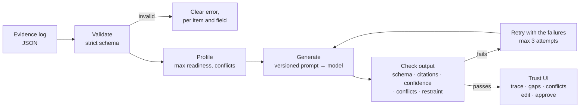

# VERA

**Validated Evidence → Ready Artifacts**

## 1. What VERA does

VERA reads a structured evidence log from a discovery engagement and drafts a **product strategy** or **roadmap** from it. Every claim cites the evidence IDs it rests on. The confidence of that evidence carries through to the wording: strong evidence produces committed statements, medium evidence produces hedged ones, and weak evidence produces hypotheses to test. When the evidence is thin, VERA holds back and says what's missing instead of writing a confident plan. The output is a proposal: a person traces, edits and approves each section, and nothing is final until they do.

## 2. Try it

**Live demo:** _link goes here after deploy_

<!-- Screenshot / GIF: strong log → trace a claim → thin log restraint → approve -->

Pick one of three sample logs (no setup), generate, then click any claim to see the evidence behind it. Start with **Strong evidence**, then switch to **Thin evidence** to watch VERA hold back.

| Sample | Client (fictional) | What it tests |
|---|---|---|
| Strong | Tidewell Physio, a 14-clinic physio network | Consistent, mostly high-confidence evidence including a randomized pilot. VERA should commit. |
| Mixed | Fernhill Market, a regional grocer | Medium-confidence evidence with two conflicts. VERA should surface them, not pick a side. |
| Thin | Quillmark Legal, a boutique law firm | Three low-confidence items. VERA should produce hypotheses and gaps, not a plan. |

## 3. Architecture



| Stage | Where | Notes |
|---|---|---|
| Evidence schema + validation | `src/evidence/` | Strict Zod schema; unknown keys, duplicate IDs and dangling conflict references are rejected |
| Confidence rules | `src/confidence/rules.ts` | The one mapping from confidence to language. Used by the prompt, the checker, the evals and the UI |
| Prompts | `prompts/*.v1.md` | Versioned files; the version is logged with every model call |
| Model access | `src/llm/` | Thin provider interface. Anthropic by default; swap by config. Max tokens and timeout per call; every call is traced |
| Generate → check → retry | `src/pipeline/`, `src/deliverables/check.ts` | Output checks are code, not prompt instructions |
| Demo server + UI | `src/server/`, `src/web/` | Bun server, SSE streaming, React UI. API key stays server-side; per-IP and daily rate limits |
| Evals | `evals/` | 20 cases across 7 runs, one command |

## 4. How confidence propagation works

Each evidence item has a confidence of `high`, `medium` or `low`. VERA turns that into language with one table:

| Evidence | Label in the UI | Wording | Committed words (*will, must, confirms, proven…*) |
|---|---|---|---|
| High | **Committed** | Stated directly | Allowed |
| Medium | **Likely** | Must include a hedge (*likely, suggests, may…*) | Not allowed |
| Low | **Hypothesis to test** | Must be framed as a hypothesis or test | Not allowed |

The model doesn't get the final say. After generation, code:

1. **Derives each claim's confidence** from the weakest evidence it cites. A claim resting on one high and one low item is low.
2. **Caps contested evidence.** If a cited item conflicts with another item at least as strong as itself, the claim is at most *Likely* until the conflict is resolved. A weaker item can't demote a stronger one: one stakeholder's opinion doesn't cap a compliance finding. Every conflict is still surfaced.
3. **Rejects claims labelled above their evidence**, and checks the wording against the table.
4. **Rejects low-confidence roadmap items marked as `build`.** They must be `validate` or `investigate`.
5. **Caps overall readiness.** A log with fewer than 5 items or no high-confidence evidence can only produce *Not enough evidence yet*, with at least 3 gaps.

Any failure goes back to the model with the specific issues, up to 3 attempts. If it still fails, VERA shows the failures rather than the output.

In the UI, confidence is visible in the form of each claim, not only its colour: a solid rule for *Committed*, dashed for *Likely*, and dotted on a tinted background for *Hypothesis to test*. If a reviewer edits a claim into wording stronger than its evidence, VERA warns them but doesn't block the edit, because the person decides.

## 5. Evals

```bash
bun run eval            # live if ANTHROPIC_API_KEY is set, otherwise replays recordings
bun run eval --record   # live run, saving raw model outputs to evals/recordings/
bun run eval --replay   # re-score saved recordings; no API calls (this runs in CI)
```

There are 20 cases over 7 runs (3 sample logs × 2 deliverables, plus the eval suite on the support-agent log):

| Category | Cases | What passes |
|---|---|---|
| Schema validity | 7 | Every run produces output that parses and passes all checks within the retry cap |
| Traceability | 3 | Every claim cites at least one real evidence ID; no invented IDs in claims, conflicts or gaps |
| Confidence fidelity | 3 | No wording above its evidence; the thin log produces only hypotheses; the strong log still commits (≥3 committed claims, ≥1 build item) so VERA isn't simply hedging everything |
| Restraint | 2 | The thin log is flagged *Not enough evidence yet*, with ≥3 gaps, no build items and no more than 8 claims |
| Conflict handling | 2 | Both conflicts in the mixed log are surfaced; nothing committed rests on contested evidence |
| Eval suite | 3 | Every case is measurable with a scenario and grader; only well-evidenced cases block release (including the compliance rule); the conflict gets a case citing both sides that never blocks |

The runner also reports how many runs passed on the first attempt, plus tokens and latency.

**Current scores:** _not yet run against a live model; results go here after the first `bun run eval --record`._

The checker and eval cases are also covered by unit tests (`bun test`): golden outputs pass, and a deliberately broken version of each one fails the check it targets.

### Eval suite deliverable (in progress)

VERA can also turn evidence into an **eval suite** for the team building an AI product's harness. Each claim is an eval case with a scenario, measurable pass criteria and a grader (`code`, `model` or `human`). Evidence confidence decides how much a case counts:

| Evidence | Role | Counts as |
|---|---|---|
| High | Regression | Must pass; a failure blocks release |
| Medium | Capability | Tracked against a threshold; doesn't block |
| Low | Exploratory | A hypothesis test that decides whether to commit |

Code enforces the same way as for other deliverables: real citations, no judgement words in pass criteria ("good", "appropriate", "correctly"…), no case in a higher role than its evidence allows, and a case citing both sides of every conflict. Approved cases export as plain JSON (`vera.eval_suite/1`, see `src/deliverables/export.ts`).

In the UI each case shows its behaviour, then **Scenario** and **Pass when**, tagged with whether it blocks release and which grader checks it. A summary line counts blocking, tracked and exploratory cases. Reviewers can edit pass criteria; wording a harness can't check gets a warning (not a block), and is flagged as `criteria_warnings` in the export. **Export JSON** includes only cases in approved sections.

The sample is a fictional insurer's AI support agent (`examples/logs/agent.json`). Until its eval cases pass on a live run, the eval suite and that sample are hidden from the public demo. Run the server with `VERA_PREVIEW=1` to see them, or use the CLI: `bun run vera generate deliverable --log examples/logs/agent.json --type eval_suite`.

## 6. Design decisions

**Why traceability.** A discovery deliverable is only as useful as the reader's ability to check it. Citing evidence IDs turns "trust the AI" into "check claim 3 against EV-007". It also gives VERA something it can verify in code: every ID must exist, so invented citations are caught every time.

**Why confidence lives in the language.** Readers skim. If a hypothesis reads like a commitment, the hedge in a footnote won't save anyone. Putting confidence into the wording, and into the visual form of each claim, means the uncertainty survives copy-paste into a slide.

**Why rules in code, not just in the prompt.** Prompts are requests; models drift between versions and providers. VERA asks the model to follow the confidence rules, then enforces them in code. The model can be more cautious than the evidence but never less, and that holds whichever model is plugged in.

**Why restraint on thin evidence.** The most expensive output a discovery tool can produce is a confident plan built on one stakeholder's opinion. VERA treats *Not enough evidence yet, and here's what would change that* as a good outcome. The thin sample exists to prove it.

**Why conflicts are surfaced, not resolved.** When a survey and the usage data disagree, which one wins is a judgment call for the team. VERA's job is to make sure nobody misses the disagreement and to suggest how to settle it.

**Why human approval.** VERA proposes; a person decides. Sections stay *Draft* until someone approves them, edits are marked, and the document only reads *Final* when every section has been approved. Unchecked streaming output is labelled as such and never presented as finished.

## 7. Run locally

Requires [Bun](https://bun.sh) 1.3+.

```bash
bun install
cp .env.example .env          # add ANTHROPIC_API_KEY for live generation
bun run dev:web               # http://localhost:3000
```

Without a key the server still runs, but it can only replay recorded runs (`evals/recordings/`).

Other commands:

```bash
bun test                                    # unit tests
bun run typecheck
bun run eval                                # eval suite
bun run vera validate examples/logs/thin.json
bun run vera generate deliverable --log examples/logs/strong.json --type strategy --out strategy.json
```

**Configuration.** Set these in the `llm` block of `vera.config.json`, or override them with environment variables:

| Setting | Env | Default |
|---|---|---|
| `provider` | `VERA_PROVIDER` | `anthropic` |
| `model` | `VERA_MODEL` | `claude-sonnet-5-5` |
| `effort` | `VERA_EFFORT` | `medium` |
| `max_tokens` | `VERA_MAX_TOKENS` | `16000` |
| `timeout_ms` | `VERA_TIMEOUT_MS` | `120000` |
| `max_retries` | `VERA_MAX_RETRIES` | `2` (3 attempts) |
| `trace` | `VERA_TRACE` | `file` → `traces/YYYY-MM-DD.jsonl` (server uses `console`) |

`VERA_PREVIEW=1` shows deliverables and samples that haven't passed a live eval run yet (currently the eval suite and the AI support-agent sample).

Demo limits: `VERA_RATE_LIMIT` (live generations per IP per window, default 6), `VERA_RATE_WINDOW_MIN` (60) and `VERA_DAILY_CAP` (300).

**Evidence log format** (see `examples/logs/` and `src/evidence/schema.ts`):

```json
{
  "schema_version": "1",
  "client": { "name": "…", "industry": "…", "description": "…" },
  "engagement": { "goal": "…", "timeline_weeks": 8, "team_size": 3, "constraints": ["…"] },
  "items": [
    {
      "id": "EV-001",
      "source_type": "interview",
      "source": "12 interviews with lapsed customers",
      "summary": "…",
      "confidence": "medium",
      "date": "2026-07-03",
      "tags": ["churn"],
      "conflicts_with": ["EV-005"]
    }
  ]
}
```

**Deploy.** The `Dockerfile` runs anywhere that runs containers. For Fly.io: `fly launch --no-deploy --copy-config`, `fly secrets set ANTHROPIC_API_KEY=…`, `fly deploy`.

---

The original command-line evidence-store tool (risks, assumptions, the monitor, Stacks sync) is still in `src/cli/`. See [docs/later/LEGACY_CLI.md](docs/later/LEGACY_CLI.md).
